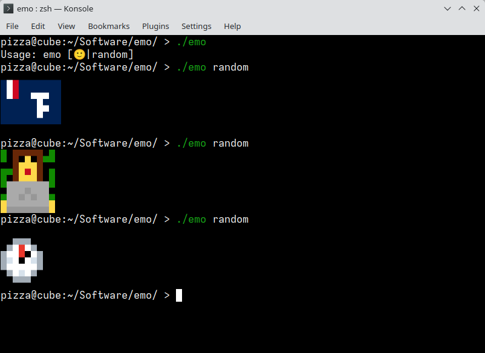

# Emo

Shows you pixelated emojis in the terminal!

## Setup

Download the [SerenityOS emojis](https://emoji.serenityos.org/) and place all of them in `~/.local/share/emo`. The directory should only contain images.

## TODO's

- Downloading the emojis from the internet and delicately placing them in `~/.local/share/emo` for you
- Being able to specify an emoji by its name
- The `--flag` flag: a flag that only shows flags
